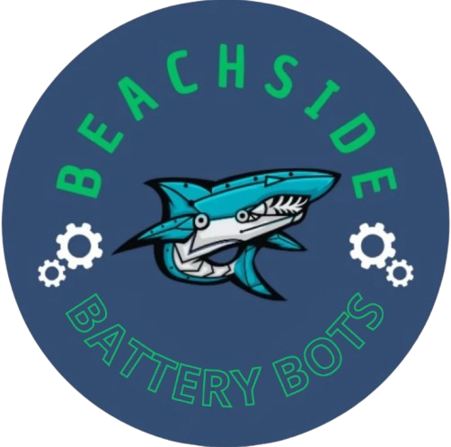

# Welcome to the Beachside Battery Bots!

  

## About Us
The **Beachside Battery Bots** (Team #32357) is a nonprofit FIRST Robotics team located at Beachside High School. Our team has over 20 dedicated members, each working on different aspects of robotics in sub-teams (Engineering, Programming, Planning, and Social Media/Advirtising).

Students will learn skills in engineering, programming, collaboration, and more as we compete in the FIRST Tech Challenge. We welcome and encourage all students to join regardless of skill or experience.

Students must follow the Beachside Robotics Club [Bylaws]([robotics_26-27_bylaws.pdf](https://drive.google.com/file/d/1lxoUdKRoW4I4tMIsVZIto4_vbbdCeVP9/view?usp=sharing))

### Our Mission
The **Beachside Battery Bots** strive to provide students hands on experiences and opportunities in technology and focusing on innovation, problem solving, computer-aided design, teamwork, and competition. Our goal is to inspire young people in our community to explore various careers in STEM fields.

## FIRST Tech Challenge
The **Beachside Battery Bots** competes in the Northeast Florida League in the FIRST Tech Challenge (FTC), a competition that strives to inspire interest in STEM through a collaborative and supportive environment that values teamwork and gracious professionalism.

For more information about the FIRST Tech Challenge, visit the [FTC Website](https://www.firstinspires.org/programs/ftc/).

## Supporting Our Team
If you wish to support our team through donations, mentorship, or food donations please contact us at batterybots.bhs@gmail.com

For more information on how you can help or the various benefits we offer, please read our [Sponsorship Packet](Sponsorship-Packet.pdf)
